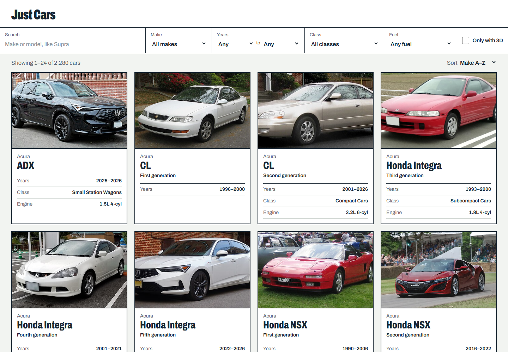
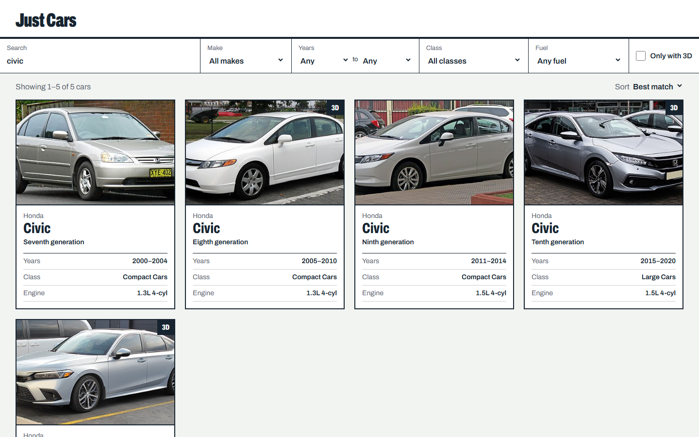
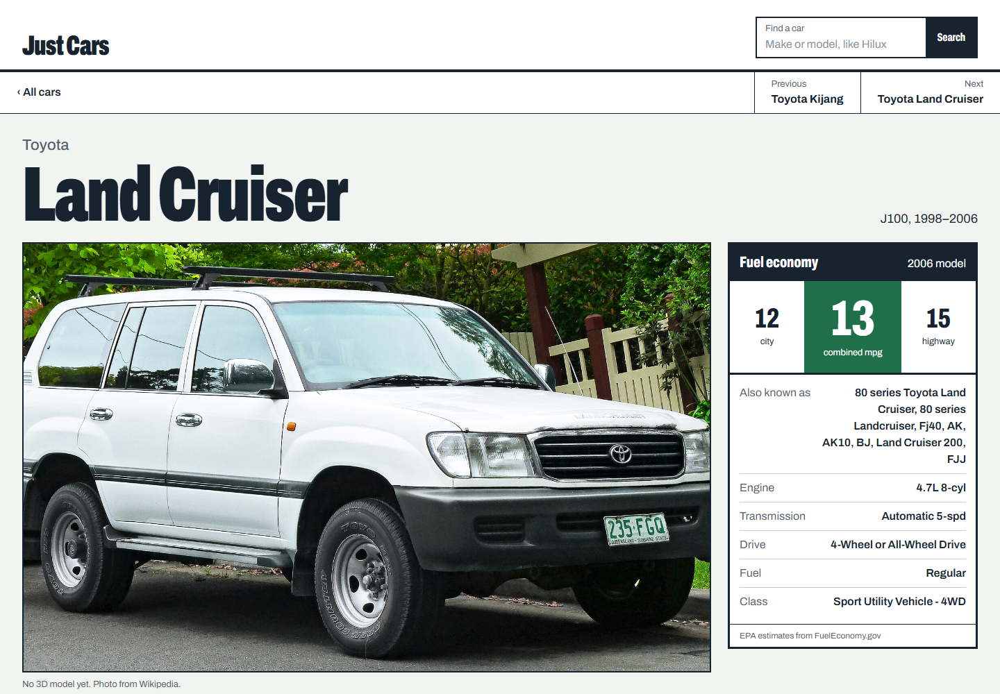

# Just Cars

Browse 2,280 cars from around the world, one card per generation, from 2000 to today. Each car gets a Wikipedia photo and description, EPA fuel economy and specs for US models, and a 3D model you can rotate (from Sketchfab) when one exists.

**Live site:** https://ervzs.github.io/just-cars/



## Features

- **Search and filter** by make, model, year range, class and fuel. Search ignores spacing, so `mx5` finds the MX-5, and name matches rank first.
- **Car pages** show the photo or 3D model, MPG, engine, transmission and drive, plus links to the model's other generations.
- **Global catalog**, including Asian-market models the US never got.

| Search | Car page |
| --- | --- |
|  |  |

## Run locally

```sh
npm install
npm run dev        # http://localhost:5173/just-cars/
```

| Script | What it does |
| --- | --- |
| `npm run dev` | Start the dev server |
| `npm run build` | Type-check and build to `dist/` |
| `npm run preview` | Serve the production build |
| `npm run lint` | Lint with oxlint |
| `npm run data` | Rebuild the car data |

## Data

`npm run data` rebuilds `public/data/` from FuelEconomy.gov, Wikipedia and Sketchfab. API responses are cached in `scripts/.cache/`, so reruns are fast.

For a quick test run, pass a limit and optional makes:

```sh
npm run data -- 20 Toyota,Isuzu
```

Test runs write to `scripts/.out-test/` and never touch `public/data/`. The year range and the list of Asian brands are set at the top of `scripts/build-data.mjs`.

## Deploy

Every push to `main` builds the site and publishes it to GitHub Pages through `.github/workflows/deploy.yml`. One-time setup: **Settings → Pages → Source: GitHub Actions**. See [deploy.md](deploy.md) for details.

## Built with

React 19, React Router, Vite, Tailwind CSS 4 and TypeScript.
